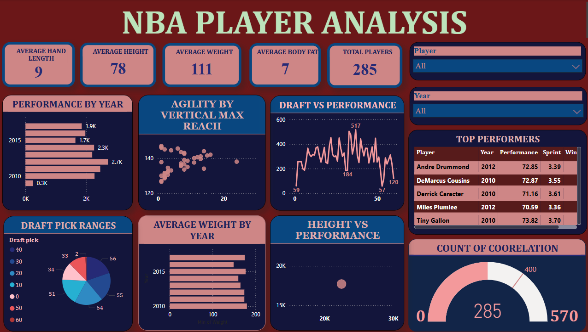

# 🏀 NBA Player Analysis Dashboard

This Power BI dashboard provides a comprehensive analysis of NBA players using physical, athletic, and draft-related data. The project leverages interactive visualizations to discover trends, evaluate performance metrics, and examine the correlation between physical attributes and on-court performance.

---

## 📌 Overview

The NBA Draft Combine collects critical data on player performance and physical measurements before they enter the professional league. This dashboard aims to help users—analysts, scouts, or fans—better understand how variables like height, weight, sprint time, and draft position relate to player success.

---

## ❓ Problem Statement

Despite a wealth of data collected during the NBA Draft Combine, it's often challenging to identify clear patterns between player attributes and their future performance.  
This dashboard seeks to answer:
- Do better physical stats correlate with better performance?
- Are high draft picks always top performers?
- What attributes do top-performing players typically have?

---

## 🎯 Objectives

- Analyze player performance across years.
- Compare draft positions with actual performance outcomes.
- Identify key physical metrics that influence performance.
- Highlight top performers and their athletic traits.
- Provide an intuitive, interactive dashboard for deeper exploration.

---

## 🔍 Key Insights

- Players drafted later can still achieve high performance (e.g., value picks).
- **Andre Drummond** and **DeMarcus Cousins** are top performers with strong agility and sprint stats.
- Performance trends vary significantly year to year, with 2010 and 2012 showing higher average performance.
- Draft distribution shows a clustering between picks **30–60**, indicating a high number of late-round entries.

---

## 🖥️ Dashboard Features

| Feature | Description |
|--------|-------------|
| **KPIs** | Show average hand length, height, weight, body fat %, and total players. |
| **Filters** | Dropdowns to filter by player and year. |
| **Performance by Year** | Bar chart showing yearly performance trends. |
| **Agility vs Vertical Reach** | Scatter plot comparing agility metrics. |
| **Draft vs Performance** | Line chart showing draft pick correlation with performance. |
| **Draft Pick Distribution** | Pie chart showing the distribution across draft pick ranges. |
| **Average Weight by Year** | Bar chart tracking how player weight changed year to year. |
| **Height vs Performance** | Bubble chart exploring height and performance relationship. |
| **Top Performers Table** | Ranked list of highest-performing players with sprint and wingspan stats. |
| **Count of Correlation** | Gauge visual displaying correlation count between variables. |

---

## 👩‍💻 Tools Used

- **Power BI** – Visualization and dashboarding
- **Excel / Pandas** – Data cleaning and preprocessing
- **Kaggle** – Dataset source

## 🖼️ Dashboard Preview

  

